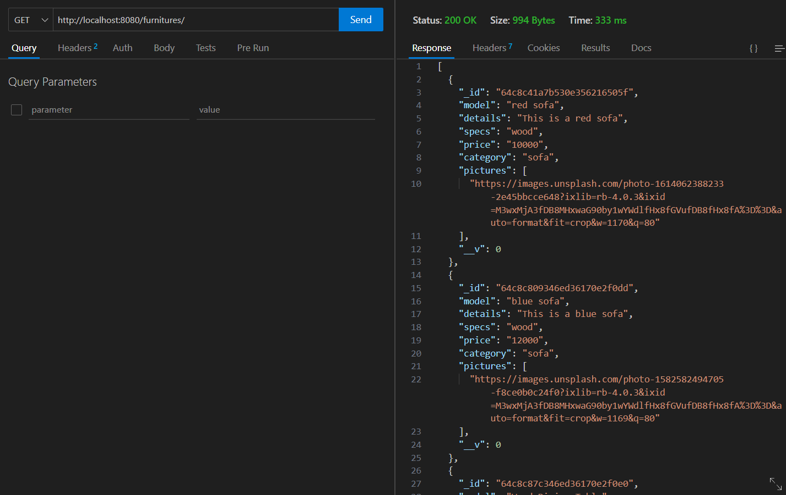
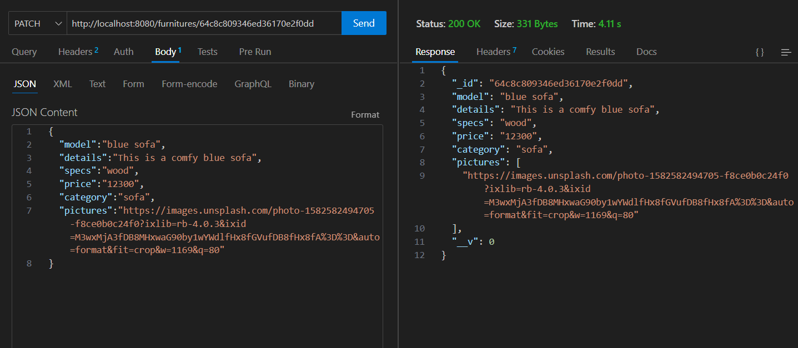
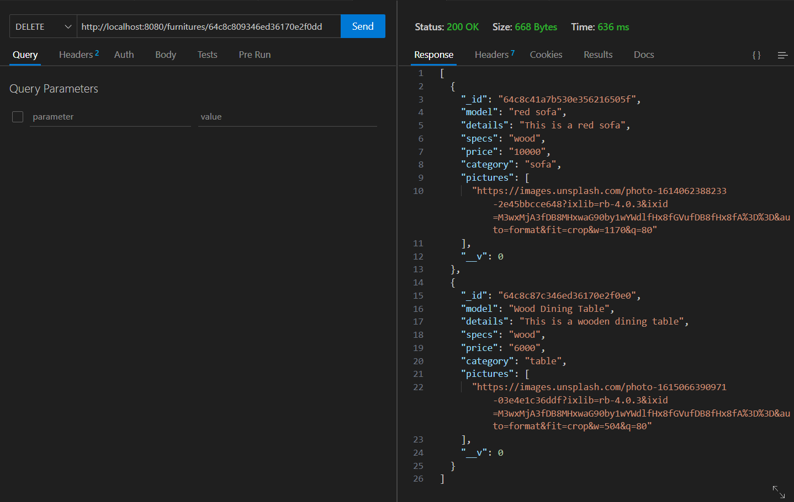
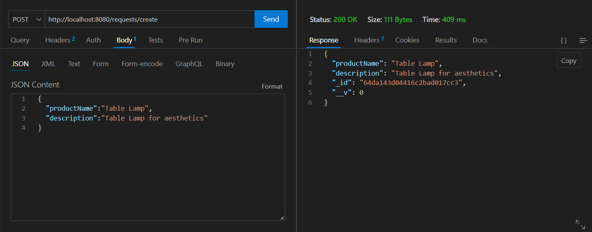
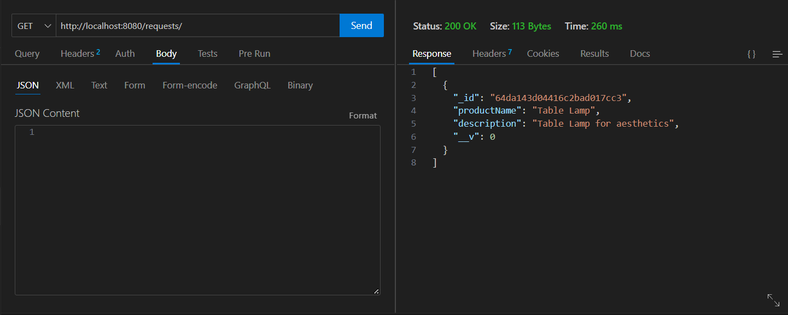
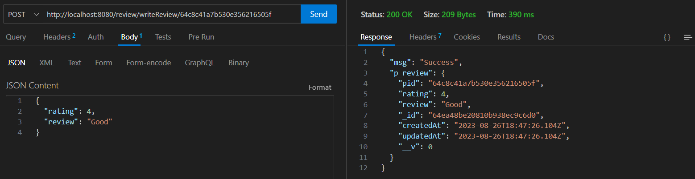
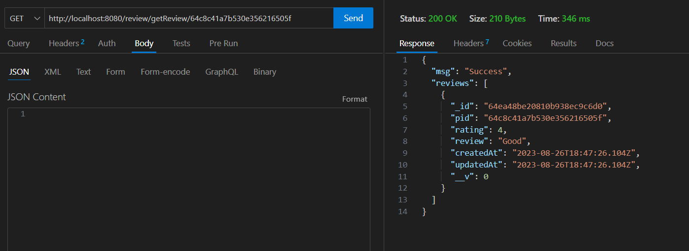

# Screenshot of API Testing

## Registration

## Login

## Add Product

## Similar Product

Here list of objects will be returned of same category. In the given example we searched similar product of blue sofa. As blue sofa belongs to sofa (category) thus it returned all the objects whose category is sofa.

## Search by Category

Here we can search by category and get details of all the products that belong to that particular category.

**Table** category

**Sofa** category

## All Products

Shows list of all products

## Update Product

Updating blue sofa

## Delete Product

Deleting blue sofa and in response we can see we only have two objects red sofa and wood dining table

## Create Request

Request for a particular product

## Get all Request

Get all the requested products

## Write Review

Post Reviews about particular product

## Get Reviews

Get all the reviews of a particular product

