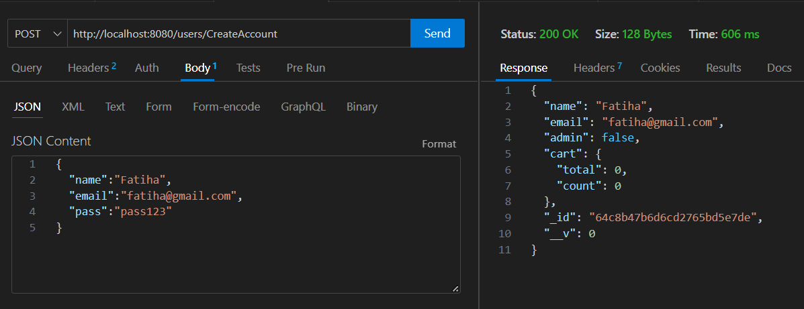
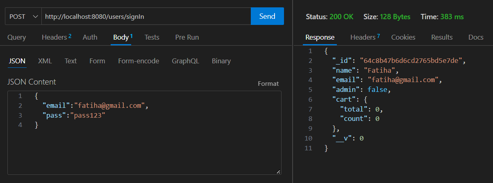
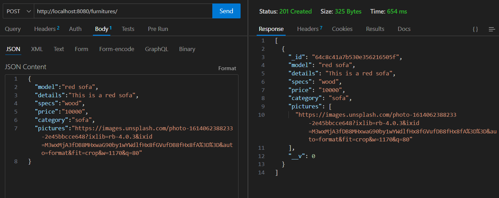
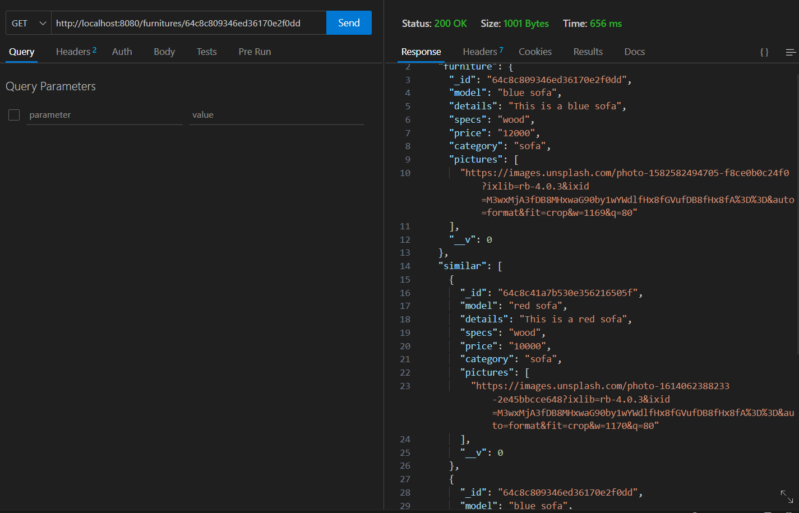
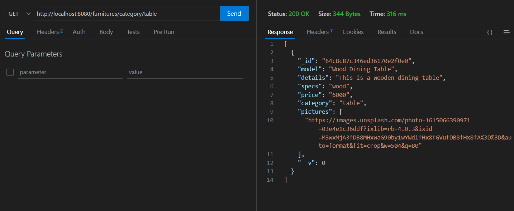
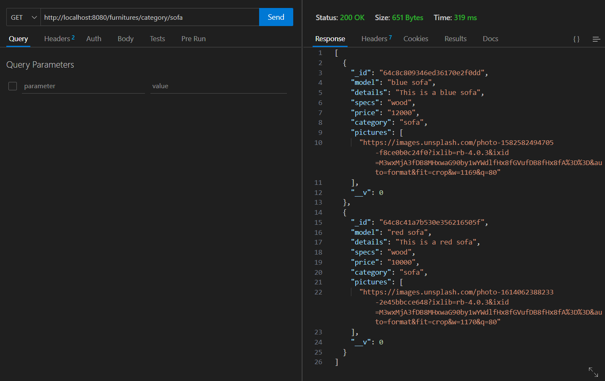

# Screenshot of API Testing

## Registration

## Login

## Add Product

## Similar Product

Here list of objects will be returned of same category. In the given example we searched similar product of blue sofa. As blue sofa belongs to sofa (category) thus it returned all the objects whose category is sofa.

## Search by Category

Here we can search by category and get details of all the products that belong to that particular category.

**Table** category

**Sofa** category

